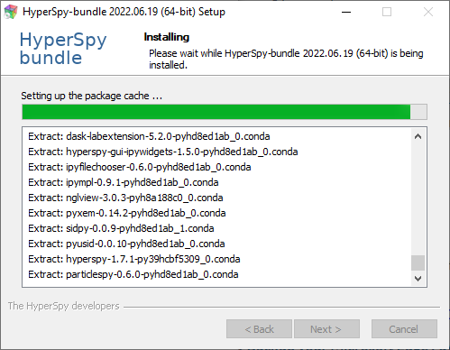

.. _linux-label:

Install
=======

.. _install_windows-label:

Windows
-------

Run the installer ``.exe`` file, accepting the default options. Doing so will
install HyperSpy into the folder you choose under a subfolder named
``hyperspy-bundle``.

.. figure:: _static/just_me_windows.png
   :width: 100 %
   :alt: Just Me (recommended)
   :figwidth: 60%

   A screenshot of the installation type selection. It is recommended to install
   for single user only (`Just Me`) to avoid permission issues when using python.

.. note::
   For more details, for example on multi-users installation, read the
   `Anaconda installation <https://docs.anaconda.com/anaconda/install/windows>`_
   instructions.

In the advanced installation options section, you can choose whether you want to
create the start menu and the context menu (right-click) shortcuts.

.. figure:: _static/installation_options_windows.png
   :width: 100 %
   :alt: Installation options
   :figwidth: 60%

   The advanced installation options section, where you can choose to install
   start menu and context menu shortcuts.

Depending on your system, the installation may take quite some 
time (especially on the "Setting up the package cache..." and 
"Setting up the base environment..." steps), but you should get a progress 
window that looks like:

   A screenshot during the bundle installation process.

And that's it! All the installed programs should now be installed and the
distribution should be available from the terminal, the context menu or the
start menu (:ref:`usage-label`).

Silent installation on Windows
^^^^^^^^^^^^^^^^^^^^^^^^^^^^^^

Using the command prompt:

.. code-block:: console

   $ start /wait "" HyperSpy-bundle-2020.02.05-Windows-x86_64.exe /S /D=%UserProfile%\HyperSpy-bundle

Using PowerShell:

.. code-block:: console

   $ Start-Process -Wait -FilePath HyperSpy-bundle-2020.02.05-Windows-x86_64.exe -ArgumentList /S /D=$env:UserProfile\HyperSpy-bundle

See the `Anaconda documentation <https://docs.anaconda.com/anaconda/install/silent-mode>`_ for more information on usage and 
more optional parameters.

.. _install_mac-label:

MacOS
-----

Run the downloaded file to proceed with the installation. This installer is
currently not identified as trusted party by macOS, meaning that macOS will
not allow to run the installer simply by double-clicking on it. However, 
control-clicking the app icon, then choosing ``Open`` from the shortcut menu 
will allow to run the installer, as explained in the 
`macOS documentation <https://support.apple.com/en-gb/guide/mac-help/mh40616/mac>`_.

.. figure:: _static/macOS_right_click_open.png
   :width: 100 %
   :alt: Links HyperSpy bundle downloads
   :figwidth: 60%

   To open the installer, control-click the installer icon and choose Open from
   the shortcut menu.

The rest of the process is fairly straightforward. For the installation 
location, we *highly* recommend to select ``Install for me only``:

.. figure:: _static/macOS_install_destination.png
   :width: 100 %
   :alt: Bundle installation progress
   :figwidth: 70%

   Single user installation is recommended.

And that's it! All the installed programs should now be installed and the
distribution should be available from the terminal or from the context menu
(:ref:`usage-label`).

.. _install_linux-label:

Linux
-----

The process is exactly the same as 
`installing Anaconda <https://docs.conda.io/projects/conda/en/latest/user-guide/install/linux.html>`_
or `Miniforge <https://github.com/conda-forge/miniforge#Install>`_:

1. In your terminal window, run:

   ..  code-block:: bash
    
       bash HyperSpy-bundle-YYYY.MM.DD-Linux-x86_64.sh

2. Follow the prompts on the installer screens.
   If you are unsure about any setting, accept the defaults. You can change
   them later.
3. To make the changes take effect, close and then re-open your terminal window.
4. Test your installation. In your terminal window, run the command 
   ``conda list``. A list of installed packages appears if it has been
   installed correctly.

.. note::
   If you choose to initialize ``conda`` during the installation, the base
   environment of the distribution will be activated in the terminal startup.
   The auto-activation can be enabled or disabled using the
   `conda init <https://docs.conda.io/projects/conda/en/latest/commands/init.html>`_
   command.

   To enable conda activation at terminal startup:

   .. code-block:: console

      $ conda init

   To disable conda activation at terminal startup:

   .. code-block:: console

      $ conda init --reverse

And that's it! All the installed programs should now be installed and the
distribution should be available from the terminal or from the context menu
(:ref:`usage-label`).
