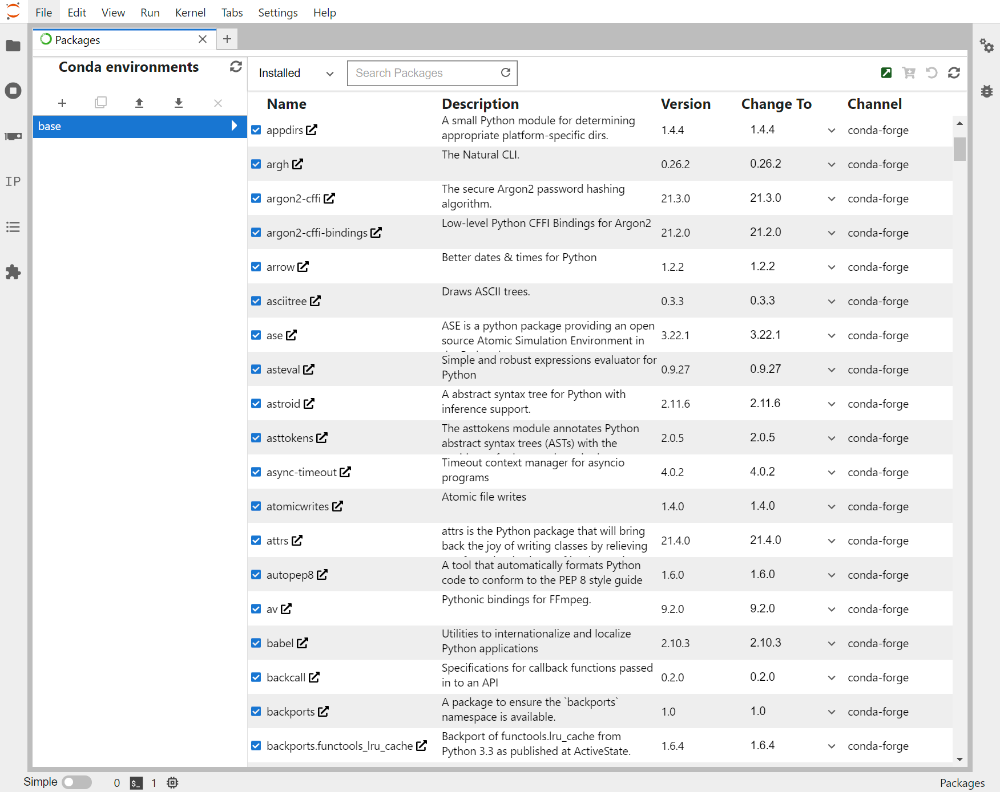
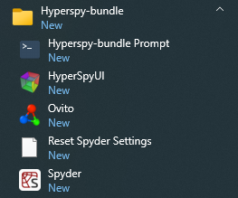

.. _usage-label:

Usage
=====

Managing libraries and conda environments
-----------------------------------------

.. note::
   For the standard version only, `i.e.` not supported for the portable version.

As an alternative to the Anaconda Navigator, the HyperSpy bundle includes
`gator <https://github.com/mamba-org/gator#gator>`_ to manage libraries
and conda environments.

   Managing environments and libraries using gator.

The packages can also be managed from the command line using
`conda <https://docs.conda.io/projects/conda>`__ or
`mamba <https://mamba.readthedocs.io>`__.
For example, the distribution can be updated easily using

.. code::

   $ conda update --all

or

.. code::

   $ mamba update --all

.. note::
   `conda <https://docs.conda.io/projects/conda>`__ is usually slow,
   when the distribution contains many libraries, as
   is the case for the hyperspy-bundle. `Mamba <https://mamba.readthedocs.io>`__
   is a fast drop-in replacement for conda.

.. _context_menu_shortcuts-label:

Context Menu Shortcuts
----------------------

The context menu shortcuts are created when the corresponding option has been selected
during :ref:`installation <install_windows-label>` using the
`start_jupyter_cm <https://github.com/hyperspy/start_jupyter_cm>`_ tool. Using these
shortcuts, the jupyter QtConsole / Lab / Notebook will start from the current folder.

.. figure:: _static/jupyter_cm_windows.png
   :width: 100 %
   :alt: Launching the interactive HyperSpy-bundle prompt console
   :figwidth: 40%

   Jupyter context menu entries.

Start Menu (Windows only)
-------------------------

Start menu shortcuts are created when the corresponding option has been selected
during :ref:`installation <install_windows-label>`. The shortcuts are provided by
the conda packages and if further conda packages are installed and contain shortcuts,
they will appear in this menu.
The HyperSpy-bundle Prompt is a command line prompt with the base conda environment
activated and is useful to run conda/mamba, python scripts or programs from the
command line.

   Start menu shortcuts of the HyperSpy-bundle distribution.
